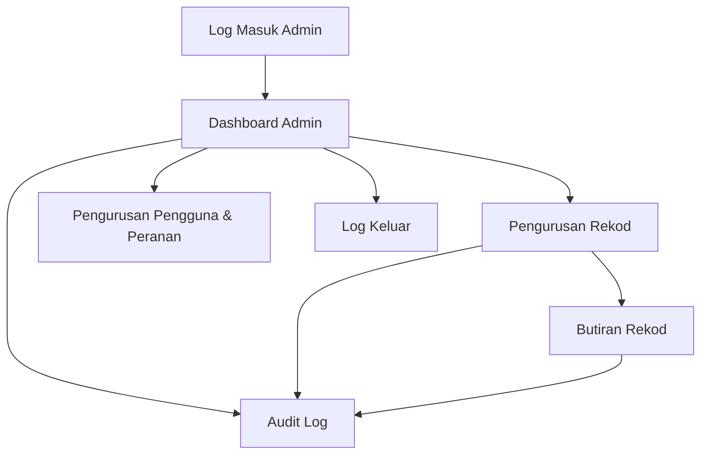

## 1. Product Overview
Kemas kini Admin Panel untuk tambah lebih banyak halaman pentadbiran dan memaparkan data secara live dari backend.
Fokus: pengurusan data teras, pengurusan pengguna/akses, dan pemantauan aktiviti melalui UI yang konsisten.

## 2. Core Features

### 2.1 User Roles
| Role | Registration Method | Core Permissions |
|------|---------------------|------------------|
| Admin | Ditambah oleh Super Admin | Boleh lihat dashboard, urus rekod, lihat audit log (mengikut kebenaran) |
| Super Admin | Akaun sedia ada / seed awal | Boleh urus pengguna, peranan, kebenaran, konfigurasi asas |

### 2.2 Feature Module
Keperluan admin panel ini terdiri daripada halaman utama berikut:
1. **Log Masuk Admin**: autentikasi, pengendalian ralat, log keluar automatik.
2. **Dashboard Admin**: metrik ringkas, status data live, pintasan ke halaman utama.
3. **Pengurusan Rekod**: senarai rekod live, carian/tapis, cipta/kemas kini/padam.
4. **Butiran Rekod**: paparan butiran, sejarah perubahan ringkas, tindakan kemas kini.
5. **Pengurusan Pengguna & Peranan**: senarai pengguna, tetapkan peranan, aktif/nyahaktif.
6. **Audit Log**: senarai aktiviti pentadbir, carian/tapis ikut masa/pengguna/aksi.

### 2.3 Page Details
| Page Name | Module Name | Feature description |
|-----------|-------------|---------------------|
| Log Masuk Admin | Borang login | Sahkan identiti melalui email+kata laluan; papar mesej ralat yang jelas; sekat akses halaman admin tanpa sesi sah |
| Log Masuk Admin | Keselamatan sesi | Simpan sesi secara selamat; auto-redirect ke dashboard selepas berjaya; sediakan tindakan log keluar |
| Dashboard Admin | Ringkasan KPI | Papar jumlah rekod, jumlah pengguna, aktiviti terkini; pautkan ke halaman berkaitan |
| Dashboard Admin | Status data live | Papar indikator “Live/Offline”; fallback kepada refresh manual bila realtime terputus |
| Pengurusan Rekod | Senarai live + carian/tapis | Papar jadual rekod dengan kemas kini live; carian kata kunci; tapis status/masa; pagination |
| Pengurusan Rekod | CRUD asas | Tambah rekod baharu; kemas kini medan penting; padam dengan pengesahan (confirm) |
| Butiran Rekod | Paparan & kemas kini | Papar butiran penuh; edit medan; simpan perubahan; papar ralat validasi |
| Butiran Rekod | Jejak perubahan ringkas | Papar senarai perubahan/aksi terbaru yang berkaitan rekod (minimum: siapa & bila) |
| Pengurusan Pengguna & Peranan | Senarai pengguna | Papar senarai pengguna admin; carian; lihat status aktif |
| Pengurusan Pengguna & Peranan | Tetapan akses | Tetapkan peranan kepada pengguna; aktif/nyahaktif akaun; halang Admin daripada naik taraf diri sendiri (kecuali Super Admin) |
| Audit Log | Senarai aktiviti | Rekod dan papar aktiviti penting (login, create/update/delete, tukar peranan); kemas kini live jika ada event baru |
| Audit Log | Carian/tapis | Tapis mengikut pengguna, jenis aksi, julat masa; eksport tidak diperlukan (tidak termasuk) |

## 3. Core Process
**Flow Admin/Super Admin**
1. Anda buka URL admin dan diminta log masuk.
2. Selepas berjaya, anda masuk ke Dashboard untuk melihat ringkasan dan status data live.
3. Anda pergi ke Pengurusan Rekod untuk melihat senarai rekod yang dikemas kini secara live.
4. Anda buka Butiran Rekod untuk semak dan kemas kini maklumat; perubahan disimpan ke backend dan UI dikemas kini.
5. (Super Admin) Anda urus pengguna/peranan untuk kawal akses.
6. Anda semak Audit Log untuk pantau aktiviti pentadbiran.
7. Anda log keluar.

## 4. Acceptance Criteria (Ringkas)
1. Akses ke mana-mana route admin tanpa sesi sah akan redirect ke Log Masuk.
2. Senarai dalam Pengurusan Rekod memaparkan data dari backend dan berubah tanpa reload penuh apabila data berubah (live), atau sekurang-kurangnya menunjukkan indikator offline + butang refresh jika realtime gagal.
3. CRUD rekod: tambah/kemas kini/padam berjaya memantulkan perubahan pada UI, dengan mesej ralat jelas jika gagal.
4. Super Admin boleh tetapkan peranan dan aktif/nyahaktif pengguna; Admin biasa tidak boleh ubah peranan.
5. Setiap aksi penting (login, create/update/delete, tukar peranan) direkodkan dan boleh dilihat pada Audit Log.
