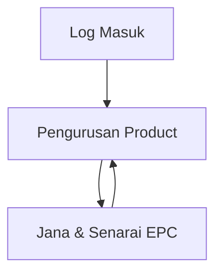

## 1. Product Overview
Sistem ringkas untuk mengurus Product dan menjana EPC secara berkelompok.
Fokus kepada input minimum Product dan penjanaan EPC menggunakan corp code (prefix + running no) dari backend.

## 2. Core Features

### 2.1 User Roles
| Role | Kaedah Pendaftaran | Core Permissions |
|------|---------------------|------------------|
| Admin / Staff | Log masuk (akaun disediakan) | Urus Product, jana EPC batch, lihat senarai EPC dijana |

### 2.2 Feature Module
Keperluan sistem terdiri daripada halaman utama berikut:
1. **Log Masuk**: autentikasi pengguna.
2. **Pengurusan Product**: tambah & urus senarai product (SKU, nama, kod produk, kategori, status, remark).
3. **Jana & Senarai EPC**: borang jana EPC batch (corp code + product/SKU + batch) dan senarai EPC yang telah dijana.

### 2.3 Page Details
| Page Name | Module Name | Feature description |
|-----------|-------------|---------------------|
| Log Masuk | Borang Login | Mengesahkan pengguna untuk akses modul admin. |
| Pengurusan Product | Senarai Product | Paparkan senarai product dengan carian ringkas (SKU/nama/kod) dan tapis (kategori/status). |
| Pengurusan Product | Add / Edit Product | Tambah/kemas kini medan: SKU, nama, kod produk, kategori, status, remark. |
| Pengurusan Product | Status Product | Tukar status (contoh: Aktif/Tidak aktif) untuk kegunaan semasa penjanaan EPC. |
| Jana & Senarai EPC | Borang Jana EPC | Pilih/isi: corp code (prefix), product + SKU, batch name, batch qty, remark; sahkan input sebelum jana. |
| Jana & Senarai EPC | Penjanaan Running No | Menjana EPC dengan format: corp prefix + running number unik (dikendalikan backend) untuk sejumlah batch qty. |
| Jana & Senarai EPC | Hasil & Sejarah Batch | Paparkan ringkasan batch (nama, qty, tarikh, remark) dan senarai EPC dijana (pagination). |

## 3. Core Process
**Aliran Admin/Staff**
1. Log masuk ke sistem.
2. Pergi ke Pengurusan Product untuk tambah product baharu atau kemas kini maklumat (SKU, kod produk, kategori, status, remark).
3. Pergi ke Jana & Senarai EPC.
4. Pilih corp code (prefix), pilih product/SKU, isi batch name, batch qty, remark.
5. Sistem menjana EPC secara automatik menggunakan running number di backend dan memaparkan senarai EPC yang dijana.
6. Admin menyemak semula batch dan EPC dalam senarai.

