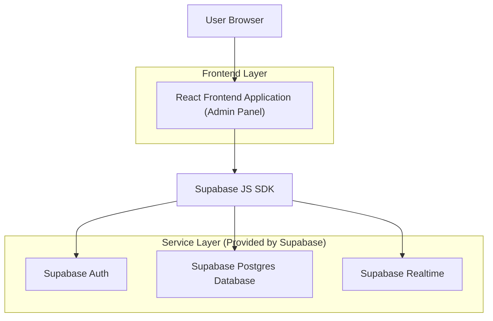
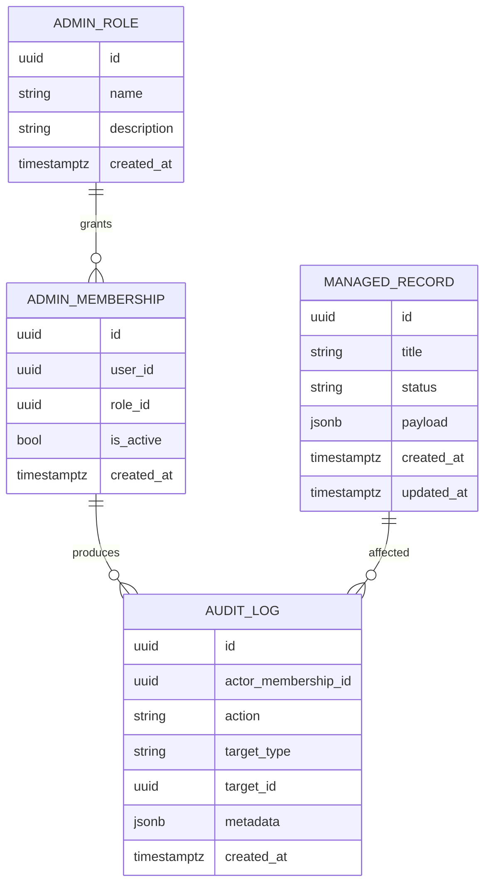

## 1.Architecture design


## 2.Technology Description
- Frontend: React@18 + vite + tailwindcss@3
- Backend: Supabase (Auth + Postgres + Realtime)

## 3.Route definitions
| Route | Purpose |
|-------|---------|
| /admin/login | Log masuk admin dan cipta sesi |
| /admin | Dashboard admin (default selepas login) |
| /admin/records | Pengurusan rekod (senarai + carian/tapis + CRUD) |
| /admin/records/:id | Butiran rekod (papar + edit) |
| /admin/users | Pengurusan pengguna & peranan (Super Admin) |
| /admin/audit | Audit log aktiviti admin |

## 6.Data model(if applicable)

### 6.1 Data model definition


### 6.2 Data Definition Language
Admin Roles (admin_roles)
```
CREATE TABLE admin_roles (
  id UUID PRIMARY KEY DEFAULT gen_random_uuid(),
  name TEXT UNIQUE NOT NULL,
  description TEXT,
  created_at TIMESTAMPTZ DEFAULT NOW()
);
```

Admin Memberships (admin_memberships)
```
CREATE TABLE admin_memberships (
  id UUID PRIMARY KEY DEFAULT gen_random_uuid(),
  user_id UUID NOT NULL,
  role_id UUID NOT NULL,
  is_active BOOLEAN NOT NULL DEFAULT TRUE,
  created_at TIMESTAMPTZ DEFAULT NOW()
);

CREATE INDEX idx_admin_memberships_user_id ON admin_memberships(user_id);
CREATE INDEX idx_admin_memberships_role_id ON admin_memberships(role_id);
```

Managed Records (managed_records)
```
CREATE TABLE managed_records (
  id UUID PRIMARY KEY DEFAULT gen_random_uuid(),
  title TEXT NOT NULL,
  status TEXT NOT NULL DEFAULT 'active',
  payload JSONB NOT NULL DEFAULT '{}'::jsonb,
  created_at TIMESTAMPTZ DEFAULT NOW(),
  updated_at TIMESTAMPTZ DEFAULT NOW()
);

CREATE INDEX idx_managed_records_created_at ON managed_records(created_at DESC);
```

Audit Logs (audit_logs)
```
CREATE TABLE audit_logs (
  id UUID PRIMARY KEY DEFAULT gen_random_uuid(),
  actor_membership_id UUID NOT NULL,
  action TEXT NOT NULL,
  target_type TEXT NOT NULL,
  target_id UUID,
  metadata JSONB NOT NULL DEFAULT '{}'::jsonb,
  created_at TIMESTAMPTZ DEFAULT NOW()
);

CREATE INDEX idx_audit_logs_created_at ON audit_logs(created_at DESC);
CREATE INDEX idx_audit_logs_actor ON audit_logs(actor_membership_id);
```

Permissions (ringkas, ikut guideline)
```
GRANT SELECT ON admin_roles TO anon;
GRANT SELECT ON managed_records TO anon;

GRANT ALL PRIVILEGES ON admin_roles TO authenticated;
GRANT ALL PRIVILEGES ON admin_memberships TO authenticated;
GRANT ALL PRIVILEGES ON managed_records TO authenticated;
GRANT ALL PRIVILEGES ON audit_logs TO authenticated;
```
