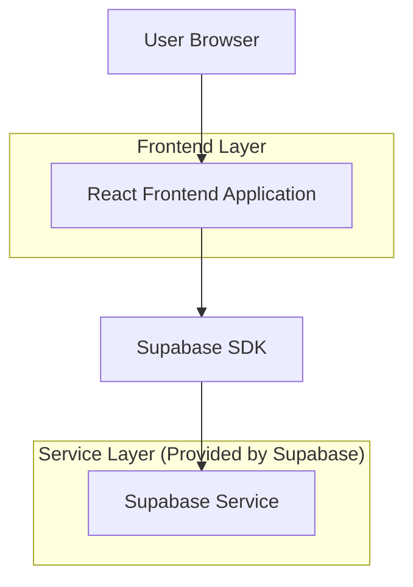
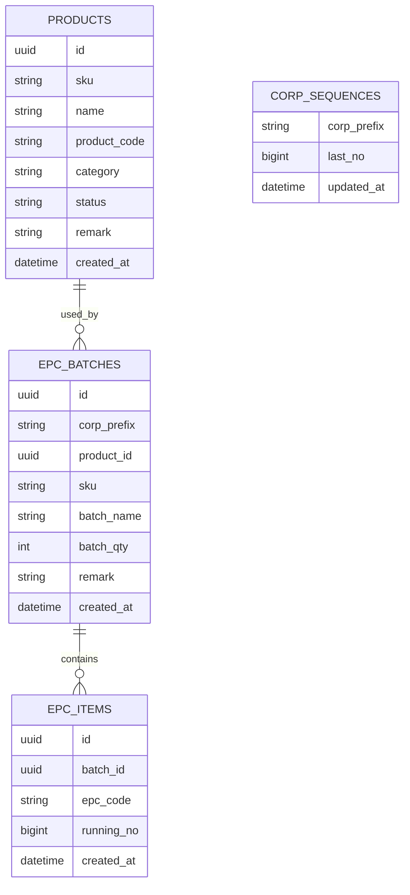

## 1.Architecture design


## 2.Technology Description
- Frontend: React@18 + vite + tailwindcss
- Backend: Supabase (Auth + PostgreSQL)

## 3.Route definitions
| Route | Purpose |
|-------|---------|
| /login | Log masuk pengguna admin/staff |
| /products | Pengurusan product (senarai + tambah/kemas kini) |
| /epc | Jana EPC batch dan lihat senarai EPC dijana |

## 6.Data model(if applicable)

### 6.1 Data model definition


### 6.2 Data Definition Language
Products (products)
```sql
CREATE TABLE products (
  id UUID PRIMARY KEY DEFAULT gen_random_uuid(),
  sku TEXT NOT NULL,
  name TEXT NOT NULL,
  product_code TEXT NOT NULL,
  category TEXT NOT NULL,
  status TEXT NOT NULL,
  remark TEXT NULL,
  created_at TIMESTAMPTZ NOT NULL DEFAULT now()
);

CREATE UNIQUE INDEX products_sku_uq ON products (sku);
CREATE INDEX products_status_idx ON products (status);
CREATE INDEX products_category_idx ON products (category);
```

Corp sequences (corp_sequences)
```sql
CREATE TABLE corp_sequences (
  corp_prefix TEXT PRIMARY KEY,
  last_no BIGINT NOT NULL DEFAULT 0,
  updated_at TIMESTAMPTZ NOT NULL DEFAULT now()
);
```

EPC batches & items (epc_batches, epc_items)
```sql
CREATE TABLE epc_batches (
  id UUID PRIMARY KEY DEFAULT gen_random_uuid(),
  corp_prefix TEXT NOT NULL,
  product_id UUID NOT NULL, -- logical FK to products.id
  sku TEXT NOT NULL,
  batch_name TEXT NOT NULL,
  batch_qty INT NOT NULL CHECK (batch_qty > 0),
  remark TEXT NULL,
  created_at TIMESTAMPTZ NOT NULL DEFAULT now()
);

CREATE TABLE epc_items (
  id UUID PRIMARY KEY DEFAULT gen_random_uuid(),
  batch_id UUID NOT NULL, -- logical FK to epc_batches.id
  epc_code TEXT NOT NULL,
  running_no BIGINT NOT NULL,
  created_at TIMESTAMPTZ NOT NULL DEFAULT now()
);

CREATE UNIQUE INDEX epc_items_epc_code_uq ON epc_items (epc_code);
CREATE INDEX epc_items_batch_id_idx ON epc_items (batch_id);
```

RPC (penjanaan EPC dengan running number atomik)
```sql
-- Menjana batch + N EPC codes menggunakan corp_prefix + running_no
-- Nota: implementasi sebenar perlu transaksi & lock per corp_prefix.
CREATE OR REPLACE FUNCTION generate_epc_batch(
  p_corp_prefix TEXT,
  p_product_id UUID,
  p_sku TEXT,
  p_batch_name TEXT,
  p_batch_qty INT,
  p_remark TEXT
)
RETURNS UUID
LANGUAGE plpgsql
AS $$
DECLARE
  v_batch_id UUID;
  v_start_no BIGINT;
  v_end_no BIGINT;
BEGIN
  -- pastikan row sequence wujud
  INSERT INTO corp_sequences (corp_prefix, last_no)
  VALUES (p_corp_prefix, 0)
  ON CONFLICT (corp_prefix) DO NOTHING;

  -- lock row sequence (atomik per corp_prefix)
  SELECT last_no INTO v_start_no
  FROM corp_sequences
  WHERE corp_prefix = p_corp_prefix
  FOR UPDATE;

  v_end_no := v_start_no + p_batch_qty;

  UPDATE corp_sequences
  SET last_no = v_end_no,
      updated_at = now()
  WHERE corp_prefix = p_corp_prefix;

  INSERT INTO epc_batches (corp_prefix, product_id, sku, batch_name, batch_qty, remark)
  VALUES (p_corp_prefix, p_product_id, p_sku, p_batch_name, p_batch_qty, p_remark)
  RETURNING id INTO v_batch_id;

  INSERT INTO epc_items (batch_id, epc_code, running_no)
  SELECT
    v_batch_id,
    (p_corp_prefix || lpad(gs::text, 10, '0')),
    gs
  FROM generate_series(v_start_no + 1, v_end_no) AS gs;

  RETURN v_batch_id;
END;
$$;
```

Permissions (rujukan ringkas)
```sql
-- Biasanya: beri baca asas kepada anon dan akses penuh kepada authenticated.
-- GRANT SELECT ON products, epc_batches, epc_items TO anon;
-- GRANT ALL PRIVILEGES ON products, epc_batches, epc_items TO authenticated;
```
