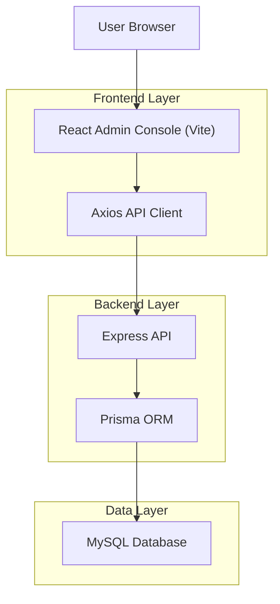
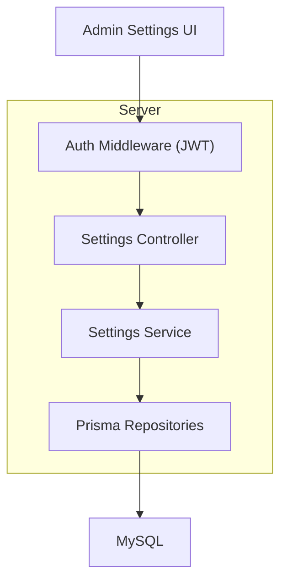
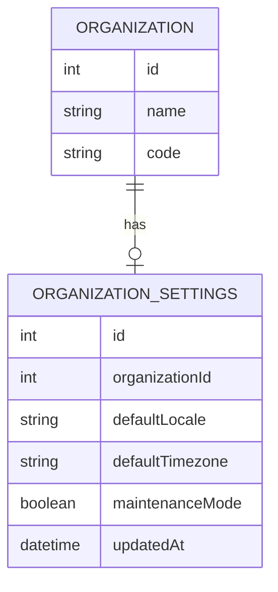

## 1.Architecture design


## 2.Technology Description
- Frontend: React@18 + react-router-dom@6 + tailwindcss@3 + vite + axios + zustand
- Backend: Express@5 + Prisma
- Database: MySQL

## 3.Route definitions
| Route | Purpose |
|-------|---------|
| /admin/login | Admin authentication to obtain a JWT token |
| /admin/settings | Admin Settings page (Profile Settings + System Settings) inside AdminShell |

## 4.API definitions (If it includes backend services)
The frontend currently authenticates via `POST /auth/login` (also available under `/api/auth/login`). The Settings page needs read/update endpoints for (1) the current user profile and (2) system settings.

### 4.1 TypeScript types (shared contracts)
```ts
type UserRole = 'super_admin' | 'admin' | 'operator';

type AdminUser = {
  id: number;
  name: string;
  email: string;
  role: UserRole;
  organizationId?: number | null;
};

type ProfileUpdateInput = {
  name?: string;
  email?: string;
  currentPassword?: string;
  newPassword?: string;
};

type SystemSettings = {
  // keep minimal and explicit; add only what the UI exposes
  organizationName?: string;
  organizationCode?: string;
  defaultLocale?: string;
  defaultTimezone?: string;
  maintenanceMode?: boolean;
};
```

### 4.2 Core API (proposed)
#### Read current profile
```
GET /api/auth/me
```
Response:
| Param Name| Param Type | Description |
|-----------|------------|-------------|
| user | AdminUser | Current authenticated user |

#### Update current profile
```
PATCH /api/auth/me
```
Request:
| Param Name| Param Type | isRequired | Description |
|-----------|-----------|------------|-------------|
| name | string | false | Update display name |
| email | string | false | Update email (if allowed) |
| currentPassword | string | false | Required when changing password |
| newPassword | string | false | New password |

#### Read system settings
```
GET /api/settings
```
Response:
| Param Name| Param Type | Description |
|-----------|------------|-------------|
| settings | SystemSettings | Current system settings |

#### Update system settings
```
PUT /api/settings
```
Request:
| Param Name| Param Type | isRequired | Description |
|-----------|-----------|------------|-------------|
| settings | SystemSettings | true | Full settings payload to store |

## 5.Server architecture diagram (If it includes backend services)


## 6.Data model(if applicable)
### 6.1 Data model definition
Recommended minimal approach is to persist system settings per organization (or globally if single-tenant). If multi-tenant, attach settings to `Organization` via a dedicated settings table.



### 6.2 Data Definition Language
Organization Settings Table (organization_settings)
```
CREATE TABLE organization_settings (
  id INT PRIMARY KEY AUTO_INCREMENT,
  organizationId INT NOT NULL,
  defaultLocale VARCHAR(20) NULL,
  defaultTimezone VARCHAR(64) NULL,
  maintenanceMode BOOLEAN NOT NULL DEFAULT FALSE,
  updatedAt TIMESTAMP NOT NULL DEFAULT CURRENT_TIMESTAMP ON UPDATE CURRENT_TIMESTAMP,
  UNIQUE KEY uq_org_settings_orgId (organizationId)
);
```
