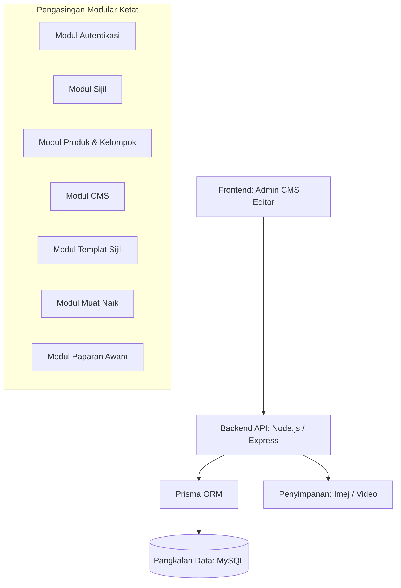

## 1. Seni Bina Sistem (Tahap Tinggi)



### 1.1 Prinsip Reka Bentuk Modular
- **Pengasingan Ketat**: Tiada pencemaran logik antara modul. Setiap modul bertanggungjawab untuk domain sendiri.
- **Berasaskan Perkhidmatan**: Modul berinteraksi melalui antaramuka perkhidmatan yang ditakrifkan.

## 2. Longgokan Teknologi (Tech Stack)
- **Backend**: Node.js (LTS), Express.js
- **Frontend**: React (Vite), Tailwind CSS, Zustand
- **Pangkalan Data**: MySQL (Prisma ORM)
- **Editor**: `react-rnd` untuk kedudukan bebas (bukan grid)
- **Validasi**: Zod
- **Autentikasi**: JWT (Bearer Token)
- **Media**: Multer (Strategi Tempatan -> S3/R2)

## 3. Model Data & Struktur JSON

### 3.1 Struktur JSON Susun Atur CMS
```json
[
  {
    "id": "block-1",
    "type": "text",
    "x": 120,
    "y": 80,
    "w": 300,
    "h": 100,
    "content": {
      "text": "Premium Bird Nest"
    }
  },
  {
    "id": "block-2",
    "type": "image",
    "x": 50,
    "y": 200,
    "w": 400,
    "h": 250,
    "content": {
      "url": "/uploads/nest.jpg"
    }
  },
  {
    "id": "block-3",
    "type": "certificate",
    "x": 100,
    "y": 500,
    "w": 500,
    "h": 300
  }
]
```

### 3.2 Struktur JSON Templat Sijil
```json
{
  "background": "/uploads/cert-bg.png",
  "fields": [
    { "key": "certificate_id", "x": 100, "y": 200 },
    { "key": "product_name", "x": 100, "y": 250 }
  ]
}
```

## 4. Logik Paparan Awam
1. **Pengesahan**: Ambil sijil melalui ID, sahkan status (`VALID`, `REVOKED`, `SUSPICIOUS`).
2. **Pengambilan Data**: Dapatkan Kelompok, Produk, dan Susun Atur CMS yang berkaitan.
3. **Suntikan**: Suntik data sijil dan produk masa nyata ke dalam pemegang tempat (placeholders) susun atur.
4. **Paparan**:
   - Gunakan **Kedudukan Mutlak (Absolute Positioning)** untuk semua blok.
   - **Ringan**: Tiada logik editor atau dependensi (contoh: `react-rnd`) digunakan semula dalam paparan awam.
   - Sokongan untuk blok teks, imej, video, dan sijil.

## 5. Reka Bentuk API (Admin & Awam)

### Admin (Peribadi)
- `POST /auth/login`
- `POST /certificates/generate` (Sokongan Kelompok + Unit)
- `POST /certificates/revoke`
- `POST /cms/page` & `POST /cms/layout`
- `POST /template`
- `POST /upload/media` & `POST /upload/excel`

### Awam
- `GET /public/cert/:certificate_id`

## 6. Keselamatan & Prestasi
- **Keselamatan**: HTTPS sahaja, Had kadar (rate limiting) untuk API awam, sanitasi XSS untuk input CMS.
- **Prestasi**:
  - Pengindeksan: `certificateId` dan `batchNo`.
  - Paginasi Admin untuk semua senarai.
  - Pemuatan malas (lazy loading) untuk semua aset media.
  - (Masa Depan) Caching Redis untuk carian sijil/halaman yang kerap.

## 7. Pelan Pembangunan Terperinci

### **Fasa 1: Asas Teras (Enjin Sistem)**
*Objektif: Membina infrastruktur backend dan logik sijil.*

#### **1.1 Persediaan Projek & Pangkalan Data**
- **Pelaksanaan**: Setup persekitaran Node.js/Express, konfigurasi Prisma untuk MySQL, dan laksanakan migrasi awal untuk semua jadual (`Product`, `Batch`, `Certificate`, `ScanLog`, dll.).
- **Pengesahan**: Pastikan jadual dicipta dalam MySQL dan Prisma Client boleh berhubung dengan pangkalan data.

#### **1.2 Autentikasi Admin (Modul Auth)**
- **Pelaksanaan**: Bina fungsi log masuk Admin, penjanaan token JWT, dan middleware kebenaran untuk melindungi laluan peribadi.
- **Pengesahan**: Uji log masuk melalui klien API (Postman/Insomnia) dan pastikan laluan dilindungi menolak permintaan tanpa token sah.

#### **1.3 Pengurusan Produk & Kelompok (Batch)**
- **Pelaksanaan**: Bina API CRUD untuk entiti `Product` dan `Batch`. Pastikan validasi ketat menggunakan Zod.
- **Pengesahan**: Berjaya mencipta produk contoh dan menghubungkannya ke kelompok pengeluaran melalui API.

#### **1.4 Enjin Penjanaan Sijil**
- **Pelaksanaan**: Laksanakan logik untuk menjana ID unik `BN-XXXXXXXXXX` menggunakan `crypto.randomBytes()`. Bina API untuk menjana sijil dalam mod "Kelompok" (Batch) dan "Unit".
- **Pengesahan**: Jana kelompok sijil ujian dan sahkan format ID, keunikan, dan penyimpanan pangkalan data yang betul.

#### **1.5 API Pengesahan Awam**
- **Pelaksanaan**: Bina titik akhir awam `GET /public/cert/:id` yang memulangkan status sijil (`VALID`, `REVOKED`) dan butiran asas produk.
- **Pengesahan**: Masukkan ID sijil yang sah dan sahkan ia memulangkan data produk berkaitan yang betul.

---

### **Fasa 2: CMS Asas & Paparan Awam**
*Objektif: Membolehkan halaman pendaratan visual dipacu oleh susun atur JSON.*

#### **2.1 Modul Penyimpanan CMS**
- **Pelaksanaan**: Bina API untuk mengurus metadata halaman CMS (`CmsPage`) dan simpan/ambil susun atur JSON yang kompleks (`CmsLayout`).
- **Pengesahan**: Simpan susun atur JSON contoh secara manual dan ambil semula melalui API.

#### **2.2 Enjin Paparan Awam**
- **Pelaksanaan**: Bina komponen React yang menghuraikan susun atur JSON dan memaparkan blok (Teks, Imej) menggunakan kedudukan mutlak.
- **Pengesahan**: Paparkan halaman pendaratan produk dengan betul menggunakan susun atur JSON contoh yang telah ditakrifkan.

---

### **Fasa 3: Pembina Visual (Editor UI)**
*Objektif: Memperkasakan pengilang dengan alat seret & lepas yang intuitif.*

#### **3.1 Editor CMS Seret & Lepas**
- **Pelaksanaan**: Integrasi `react-rnd` ke dalam Papan Pemuka Admin untuk membolehkan seret, ubah saiz, dan kedudukan blok CMS secara bebas.
- **Pengesahan**: Bina dan simpan susun atur halaman pendaratan yang lengkap secara visual di dalam panel admin.

#### **3.2 Pembina Sijil Visual**
- **Pelaksanaan**: Bina UI untuk muat naik latar belakang sijil dan menetapkan hamparan medan dinamik (ID Sijil, Nama Produk) menggunakan koordinat X/Y.
- **Pengesahan**: Reka templat sijil dan sahkan data sebenar dipaparkan dengan betul di atas imej latar belakang.

---

### **Fasa 4: Keselamatan, Analitik & Pelancaran**
*Objektif: Melaksanakan pengesanan penipuan dan bersedia untuk produksi.*

#### **4.1 Penjejakan Imbasan (Log Imbasan)**
- **Pelaksanaan**: Laksanakan logik untuk merekod setiap percubaan imbasan (IP, Ejen Pengguna, Cap Masa) ke dalam jadual `ScanLog`.
- **Pengesahan**: Lakukan beberapa imbasan dan sahkan log direkodkan dengan tepat dalam pangkalan data.

#### **4.2 Sistem Pengesanan Penipuan**
- **Pelaksanaan**: Bina perkhidmatan untuk memantau corak `ScanLog`. Tandakan sijil secara automatik sebagai `SUSPICIOUS` jika diimbas dari berbilang IP atau lokasi dalam tempoh masa tertentu.
- **Pengesahan**: Simulasikan imbasan dari IP berbeza dan sahkan status sijil dikemas kini kepada `SUSPICIOUS`.

#### **4.3 Pengoptimuman & triển khai (Deployment)**
- **Pelaksanaan**: Muktamadkan pengindeksan pangkalan data, laksanakan pemuatan malas untuk media, dan tetapkan PM2/Nginx untuk penggunaan VPS.
- **Pengesahan**: Lakukan ujian beban (load test) dan sahkan sistem kekal stabil dan berprestasi di bawah trafik.

## 8. Pengurusan Risiko
- **JSON MySQL**: Dikendalikan dengan mengekalkan medan yang boleh dicari dalam lajur standard.
- **Kebolehramalan NFC**: Diselesaikan oleh `crypto.randomBytes()` untuk ID entropi tinggi.
- **Pengesanan Penipuan**: Log IP, Ejen Pengguna, dan corak lokasi dalam `ScanLog`. Tandakan `SUSPICIOUS` pada imbasan kekerapan tinggi atau berbilang lokasi.
